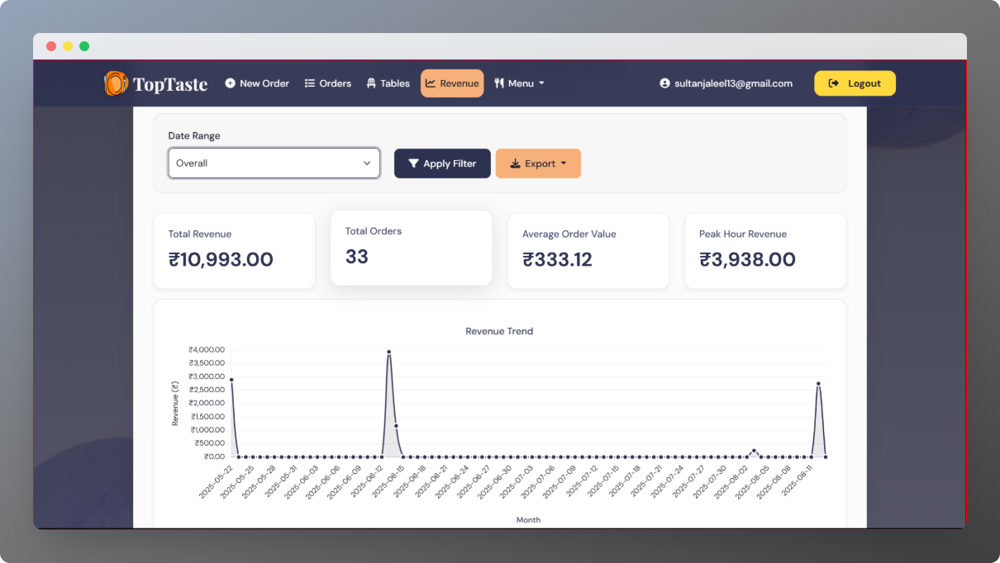
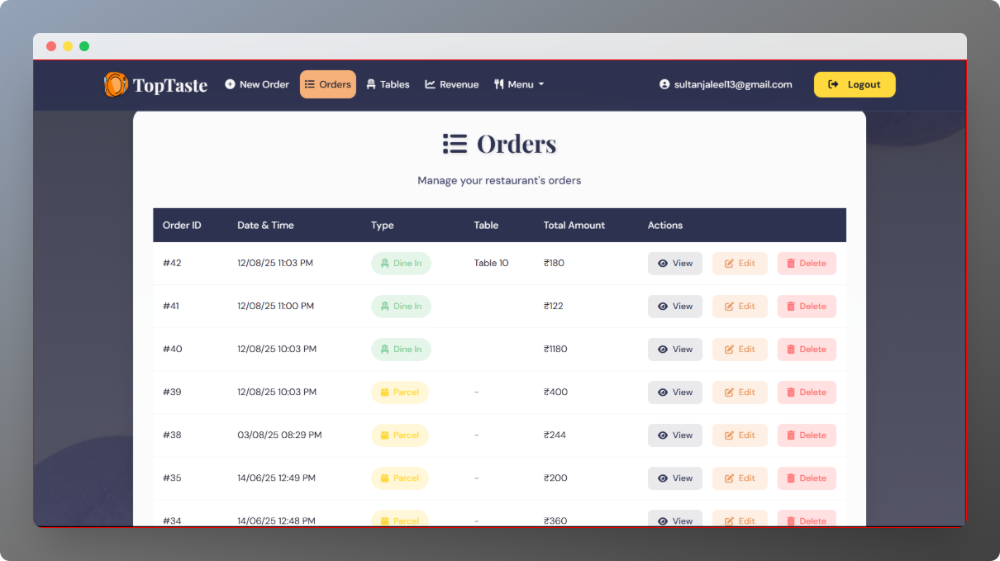

---
<h1 align="center">🍽 Restaurant Billing System</h1>

<p align="center">
  <b>A complete restaurant billing & order management solution built with Django</b><br>
  Dine-in & parcel orders | KOT & bill printing | Revenue analytics | Excel & WhatsApp export
</p>

<!-- Badges -->
<p align="center">
  
  
  
</p>

---

## 🚀 Features 

### 🛒 Order & Table Management
- Create and manage orders for **dine-in** or **parcel** customers
- Assign tables for dine-in customers
- Edit table orders, print KOT, or clear tables instantly

### 📜 Orders Overview
- View all completed orders with type (dine-in/parcel) and total cost
- Search and filter order history

### 📊 Revenue Dashboard
- **Daily, Monthly, Yesterday, or Custom Date Range** revenue reports
- Interactive graphs with **Chart.js** and **NumPy** for smooth transitions & hover animations
- Line graphs for single days and bar charts for monthly data

### 📤 Data Export
- Export revenue reports (selected by date range) to **Excel**
- Send reports directly via **WhatsApp**

### 📋 Menu & Items Management
- Add new items with category, price, and details
- Categorized menu display for quick access

### 🖨 Printer Integration
- Integrated with **thermal printers** for:
  - Kitchen Order Ticket (**KOT**) printing
  - Customer billing receipts

### 📱 Mobile Friendly
- Fully **responsive UI/UX** built with **Bootstrap**
- Optimized for desktops, tablets, and smartphones

---

## 🛠 Tech Stack

| Technology       | Purpose |
|------------------|---------|
| **Django**       | Backend framework |
| **HTML/CSS/JS**  | Frontend structure & styling |
| **Bootstrap**    | Responsive UI framework |
| **SQLite**        | Database |
| **Chart.js**     | Graphs & data visualization |
| **NumPy**        | Data calculations for charts |
| **ESC/POS**      | Thermal printer integration |
| **WhatsApp API** | Report sharing |

---

## 📦 Installation

1. **Clone the repository**
   ```bash
   git clone https://github.com/yourusername/restaurant-billing-system.git
   cd restaurant-billing-system
   ```

2. **Create & activate a virtual environment**

   ```bash
   python -m venv venv
   source venv/bin/activate   # Linux/Mac
   venv\Scripts\activate      # Windows
   ```

3. **Install dependencies**

   ```bash
   pip install -r requirements.txt
   ```


5. **Run migrations**

   ```bash
   python manage.py makemigrations
   python manage.py migrate
   ```

6. **Create superuser**

   ```bash
   python manage.py createsuperuser
   ```

7. **Run the server**

   ```bash
   python manage.py runserver
   ```

8. **Access the app**

   ```
   http://127.0.0.1:8000/
   ```

---

## 📸 Screenshots
<br>
<p align="center">
  Dashboard
   <br>
</p>
<p align="center">
  
  
  
  
</p>
<br>

<p align="center">
  Revenue System
   <br>
</p>
<p align="center">
  
  
  
  
  
</p>
<br>

<p align="center">
  <i>Order Management Panel</i>
    <br>
</p>
<p align="center">
  
  
  
</p>
<br>

<p align="center">
  <i>Table Management System</i>
    <br>
</p>
<p align="center">
  
</p>
<br>

<p align="center">
  <i>Restaurant Menu</i>
    <br>
</p>
<p align="center">
  
  
</p>
<br>


---

## 📜 License

This project is licensed under the MIT License - see the [LICENSE](LICENSE) file for details.

---

## 📬 Contact

📧 **Email:** [samnanjaleel22@gmail.com](mailto:samnanjaleel22@gmail.com)

📬 **Contact me:** +91 9746156102

---

<p align="center">⭐ If you found this project useful, consider giving it a star!</p>


---